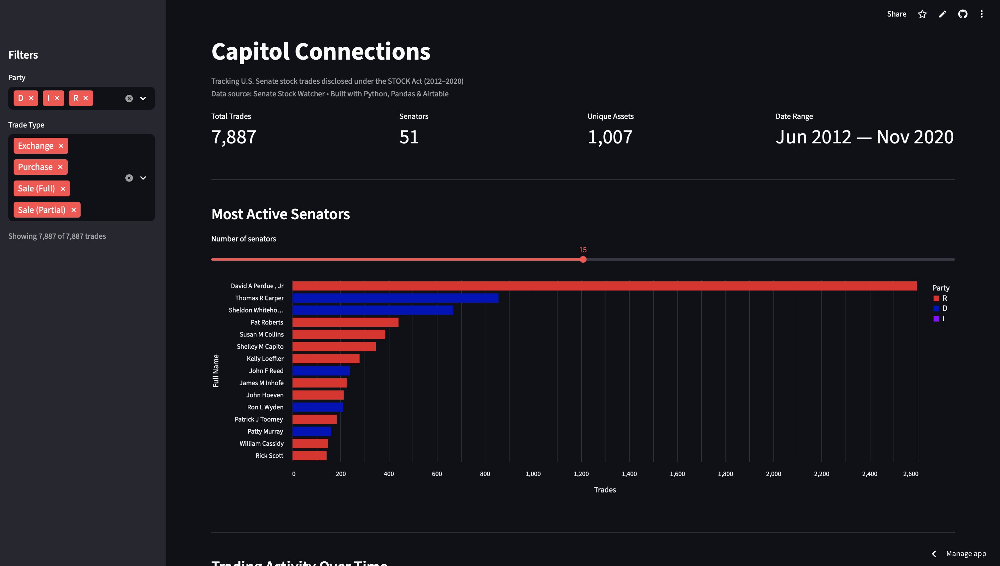

# Capitol Connections

An end-to-end ETL pipeline and interactive dashboard tracking U.S. Senate stock trades disclosed under the STOCK Act.

**[Live Dashboard →](https://capitol-connections.streamlit.app)**



---

## Overview

Members of Congress are required to disclose stock transactions under the [STOCK Act](https://en.wikipedia.org/wiki/STOCK_Act). Capitol Connections ingests this public data, normalizes it into a relational backend, enriches it with legislator metadata, and serves it through an interactive dashboard — giving anyone a clear view into Senate trading activity.

The project covers **8 years of trading data (2012–2020)**, spanning **51 senators**, **1,000+ unique assets**, and **7,800+ individual trades**.

---

## Architecture

```
Senate Stock Watcher (GitHub)          @unitedstates/congress-legislators
        │                                          │
        ▼                                          ▼
    ┌────────┐    ┌───────────┐    ┌────────┐    ┌─────────┐
    │Extract │───▶│ Transform │───▶│  Load  │◀───│ Enrich  │
    └────────┘    └───────────┘    └────────┘    └─────────┘
                                       │
                                       ▼
                                  ┌──────────┐
                                  │ Airtable │
                                  │ (3 linked│
                                  │  tables) │
                                  └────┬─────┘
                                       │
                                       ▼
                                  ┌──────────┐    ┌───────────┐
                                  │  Cache   │───▶│ Streamlit │
                                  │(Parquet) │    │ Dashboard │
                                  └──────────┘    └───────────┘
```

**Data flow:** Raw JSON → cleaned and deduplicated with Pandas → loaded into three normalized Airtable tables with referential linking → enriched with party and state metadata → denormalized into a Parquet cache → served through an interactive Streamlit dashboard.

---

## Tech Stack

| Layer          | Technology              | Purpose                                         |
| -------------- | ----------------------- | ----------------------------------------------- |
| Extraction     | Python `requests`       | Fetch raw transaction JSON from GitHub          |
| Transformation | Pandas                  | Clean, deduplicate, normalize, type coerce      |
| Storage        | Airtable                | Relational backend with linked tables           |
| Enrichment     | `@unitedstates` project | Legislator metadata (party, state)              |
| Caching        | Apache Parquet          | Denormalized flat file for fast dashboard reads |
| Frontend       | Streamlit + Altair      | Interactive visualization and filtering         |

---

## Database Schema

Three normalized tables with referential integrity:

**Politicians** — One record per senator. Fields: Full Name, Party, State, Chamber.

**Assets** — One record per unique ticker. Fields: Ticker, Asset Name, Asset Type.

**Trades** — One record per transaction, linked to both Politicians and Assets. Fields: Trade Date, Trade Type, Amount Range, Description.

This structure eliminates update anomalies — updating a senator's party happens in one place, not across thousands of trade rows.

---

## Dashboard Features

- **KPI bar** — total trades, unique senators, unique assets, and date range at a glance
- **Most Active Senators** — horizontal bar chart ranked by trade count, colored by party affiliation
- **Trading Activity Over Time** — monthly trade volume as an interactive line chart with data point markers
- **Senator Deep Dive** — select any senator to view their party, state, total trades, and a full sortable trade table
- **Sidebar filters** — filter all aggregate views by party and trade type in real time

### Accessibility

- **Screen reader support** — all Altair charts include descriptive `aria-label` alt text
- **Keyboard navigation** — all interactive controls (dropdowns, sliders, multiselects) are fully navigable via Tab, Enter, and arrow keys
- **Data point markers** — timeline chart includes visible point markers for improved visual tracking
- **Tooltips** — hover any chart element for detailed data, supporting both mouse and keyboard interaction

---

## Data Pipeline Details

### Extract

Fetches raw Senate STOCK Act disclosure data from the [Senate Stock Watcher](https://github.com/timothycarambat/senate-stock-watcher-data) open-source dataset (8,350 raw records).

### Transform

- Replaces sentinel values (`"--"`, `"N/A"`, `""`) with proper nulls
- Renames columns to match the Airtable schema
- Drops records with null trade types (463 records)
- Parses dates with coercion for malformed entries
- Deduplicates politicians (51 unique) and assets (1,007 unique)

### Load

- Batches Airtable writes at 10 records per request with rate limiting (~4.5 req/sec)
- Loads parent tables (Politicians, Assets) first, then links child records (Trades) via Airtable record IDs
- Handles pagination for all read operations (100 records/page with offset tokens)

### Enrich

- Fetches current and historical legislator data from the [@unitedstates/congress-legislators](https://github.com/unitedstates/congress-legislators) project
- Builds a fuzzy name-matching lookup with multiple name variations per legislator
- Handles edge cases (legal names vs. common names) via a manual override map
- PATCHes Airtable records additively — only fills empty fields, never overwrites

### Cache

- Denormalizes all three Airtable tables back into a single flat DataFrame
- Resolves linked record IDs into human-readable values
- Saves as Parquet for type-safe, fast reads
- Auto-generates on first deployment if missing (self-healing for Streamlit Cloud)

---

## Getting Started

### Prerequisites

- Python 3.11+
- An [Airtable](https://airtable.com) account with a Personal Access Token

### Installation

```bash
git clone https://github.com/rornela/Capitol-Connections.git
cd Capitol-Connections
python -m venv venv
source venv/bin/activate
pip install -r requirements.txt
```

### Environment Variables

Create a `.env` file in the project root:

```
AIRTABLE_PAT=your_personal_access_token
AIRTABLE_BASE_ID=your_base_id
AIRTABLE_TABLE_POLITICIANS=your_politicians_table_id
AIRTABLE_TABLE_ASSETS=your_assets_table_id
AIRTABLE_TABLE_TRADES=your_trades_table_id
```

### Run the Pipeline

```bash
# Run the full ETL pipeline (extract → transform → load)
python pipeline.py

# Enrich politicians with party and state data
python enrich.py

# Build the dashboard cache
python cache.py
```

### Launch the Dashboard

```bash
streamlit run app.py
```

---

## Project Structure

```
capitol-connections/
├── app.py               # Streamlit dashboard
├── cache.py             # Airtable → Parquet denormalization
├── pipeline.py          # Main ETL orchestrator
├── transform.py         # Data cleaning and normalization
├── load.py              # Airtable loading with record linking
├── airtable_client.py   # Reusable API client (batching, rate limiting, pagination)
├── enrich.py            # Politician metadata enrichment
├── requirements.txt     # Python dependencies
├── .env                 # API credentials (not tracked)
├── .gitignore
├── assets/
│   └── Dash-Screenshot.png
└── data/
    └── trades_enriched.parquet  (generated, not tracked)
```

---

## License

This project uses publicly available data disclosed under the STOCK Act. Legislator metadata is sourced from the [@unitedstates project](https://github.com/unitedstates/congress-legislators), a public domain civic data initiative.
